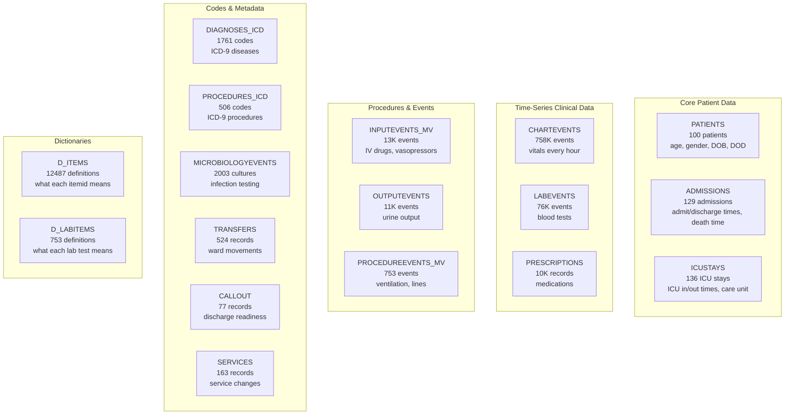
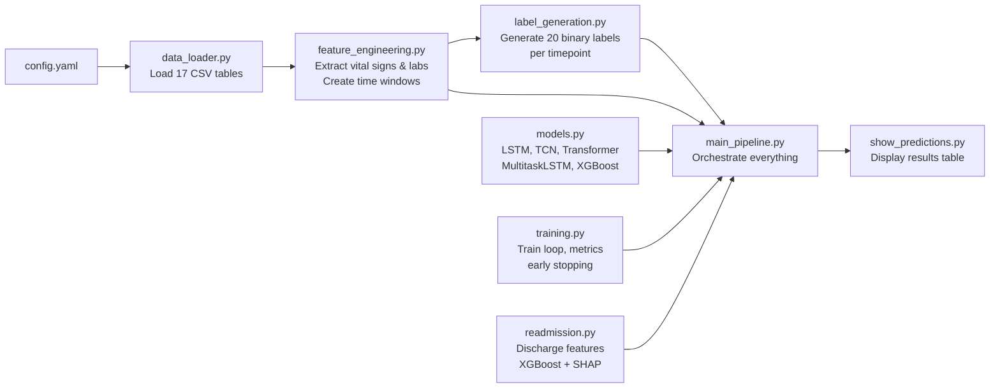
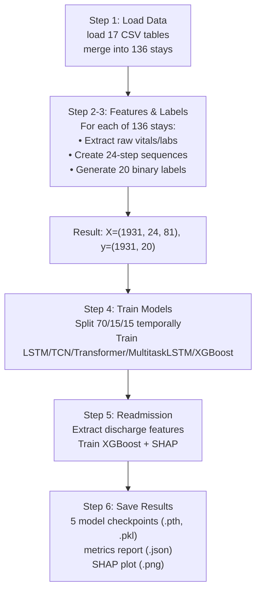

# Smart ICU Assistant — Complete Project Explainer

## 1. What Is This Project?

This is an **AI-powered Early Warning System for ICU patients**. It takes real patient data from an ICU (heart rate, blood pressure, lab tests, medications, etc.) and predicts **22 different bad outcomes** before they happen — giving doctors time to intervene.

Think of it like a weather forecast, but for patient health: *"This patient has a 78% chance of developing sepsis in the next 12 hours."*

---

## 2. The Dataset: MIMIC-III

**MIMIC-III** (Medical Information Mart for Intensive Care) is a real, de-identified database of ~40,000 ICU patients from Beth Israel Deaconess Medical Center (Boston). You're using the **demo subset** (100 patients, 136 ICU stays).

### The 17 Tables You Load



### How The Data Connects

Every row in CHARTEVENTS has an [itemid](file:///d:/PRJKT/SEM-4-PROJECT/data_loader.py#348-369) (e.g., 220045 = Heart Rate) and a `valuenum` (e.g., 88). The D_ITEMS table tells you what each itemid means. The tables connect through:

```
PATIENTS ──(subject_id)──> ADMISSIONS ──(hadm_id)──> ICUSTAYS ──(icustay_id)──> CHARTEVENTS/LABEVENTS
```

---

## 3. The Code Files — What Each Does

### Architecture Overview



---

### File 1: [config.yaml](file:///d:/PRJKT/SEM-4-PROJECT/config.yaml)
**Role:** Central configuration — all hyperparameters, thresholds, and itemid mappings.

| Section | What It Controls |
|---------|-----------------|
| `TIME_WINDOWS` | Prediction horizons: mortality at 6/12/24h, hypotension at 1/3/6h, etc. |
| `VITAL_SIGNS` | Which vitals to extract: heartrate, meanbp, tempc, spo2, etc. |
| `LAB_TESTS` | Which labs to extract: creatinine, lactate, wbc, etc. |
| `LSTM_CONFIG` | hidden_size=128, num_layers=2, dropout=0.3, epochs=50 |
| `TCN_CONFIG` | num_channels=[64,128,256], kernel_size=3 |
| `TRANSFORMER_CONFIG` | d_model=128, nhead=8, num_layers=3 |
| `XGBOOST_CONFIG` | max_depth=6, n_estimators=100 |
| `SEPSIS_CRITERIA` | SIRS thresholds: temp>38.3°C, HR>90, RR>20, WBC>12K |
| `AKI_KDIGO_STAGES` | Creatinine increase thresholds for each AKI stage |
| `VENTILATION_ITEMIDS` | Itemids 225792, 225794, 226260 for vent detection |
| `VASOPRESSOR_ITEMIDS` | Itemids for norepinephrine, epinephrine, etc. |

---

### File 2: [data_loader.py](file:///d:/PRJKT/SEM-4-PROJECT/data_loader.py)
**Role:** Reads all 17 CSV files, parses dates, and merges into a master DataFrame.

**Key steps in [merge_data()](file:///d:/PRJKT/SEM-4-PROJECT/data_loader.py#370-450):**
1. Load each CSV with proper datetime parsing
2. Join `PATIENTS + ICUSTAYS + ADMISSIONS` on `subject_id` and `hadm_id`
3. Calculate [age](file:///d:/PRJKT/SEM-4-PROJECT/data_loader.py#424-429) and `time_to_death` for each stay
4. Result: 136 rows, one per ICU stay, with demographics + times

**Key method:** [get_patient_timeseries(icustay_id)](file:///d:/PRJKT/SEM-4-PROJECT/data_loader.py#451-469) returns raw [(chartevents, labevents)](file:///d:/PRJKT/SEM-4-PROJECT/models.py#315-333) for one stay.

---

### File 3: [feature_engineering.py](file:///d:/PRJKT/SEM-4-PROJECT/feature_engineering.py)
**Role:** Converts raw events into ML-ready feature matrices.

**Step-by-step:**
1. **[extract_vital_signs()](file:///d:/PRJKT/SEM-4-PROJECT/feature_engineering.py#40-96)** — Filters CHARTEVENTS by vital itemids → pivots to wide format → columns: `heartrate`, `meanbp`, `tempc`, `resprate`, `spo2`, `sysbp`, `diasbp`, `glucose`
2. **[extract_lab_tests()](file:///d:/PRJKT/SEM-4-PROJECT/feature_engineering.py#97-153)** — Same but for LABEVENTS → columns: `creatinine`, `lactate`, `wbc`, `hemoglobin`, `platelets`, `bicarbonate`, `chloride`
3. **[create_time_windows()](file:///d:/PRJKT/SEM-4-PROJECT/feature_engineering.py#190-245)** — For each column, creates rolling aggregation stats:
   - `heartrate_mean_1h`, `heartrate_std_1h`, `heartrate_min_1h`, `heartrate_max_1h`, `heartrate_trend_1h`
   - This creates **5 features × 15 raw signals = ~75-81 features** per timestep
4. **[compute_derived_features()](file:///d:/PRJKT/SEM-4-PROJECT/feature_engineering.py#246-271)** — Adds clinical scores: shock index (HR/SBP), pulse pressure
5. **[create_sequences()](file:///d:/PRJKT/SEM-4-PROJECT/feature_engineering.py#316-358)** — Slides a window of 24 timesteps across the features → output shape: `[n_sequences, 24, 81]`

**The output:** Each sequence is a 24-hour window of 81 features — this is what the models actually see.

---

### File 4: [label_generation.py](file:///d:/PRJKT/SEM-4-PROJECT/label_generation.py)
**Role:** For each 24-hour window, generates 20 binary labels (will this bad thing happen?).

#### How Each Label Is Generated:

| Label | Clinical Definition | Code Logic |
|-------|-------------------|------------|
| **mortality_Xh** | Patient dies within X hours | Checks if `deathtime` falls within [current_time, current_time + X hours] |
| **sepsis_Xh** | Sepsis develops within X hours | Requires ≥2 SIRS criteria (temp, HR, RR, WBC) AND infection evidence (antibiotics in prescriptions OR ICD-9 sepsis codes 038, 995.91, 995.92) |
| **aki_stageN_Xh** | AKI stage N within X hours | Compares future creatinine to baseline (lowest in past 48h). Stage 1: ≥0.3 increase or 1.5× baseline. Stage 2: 2.0× baseline. Stage 3: 3.0× or >4.0 |
| **hypotension_Xh** | MAP < 65 mmHg within X hours | Checks if any mean arterial blood pressure reading falls below 65 |
| **vasopressor_Xh** | Vasopressor needed within X hours | Checks prescriptions for drugs: norepinephrine, epinephrine, vasopressin, dopamine, dobutamine |
| **ventilation_Xh** | Mechanical ventilation within X hours | Checks CHARTEVENTS for vent itemids (225792, 225794, 226260), PROCEDUREEVENTS for vent procedures, and ICD-9 vent codes (9670-9672, 9604) |

---

### File 5: [models.py](file:///d:/PRJKT/SEM-4-PROJECT/models.py)
**Role:** Defines all 5 neural network architectures.

#### Model 1: LSTM (Long Short-Term Memory)
```
Input [batch, 24, 81] → Bidirectional LSTM (2 layers, 128 hidden)
→ Attention → BatchNorm → Dropout → Linear → Sigmoid → [batch, 20]
```
- **Why LSTM?** It remembers long-term patterns — perfect for mortality where organ failure develops over hours/days
- **Bidirectional** means it reads the sequence forward AND backward
- **Attention** lets it focus on the most important timesteps

#### Model 2: TCN (Temporal Convolutional Network)
```
Input [batch, 81, 24] → 3 TCN blocks with dilated convolutions
→ Global Average Pool → Linear → Sigmoid → [batch, 20]
```
- **Why TCN?** Dilated convolutions capture patterns at multiple time scales
- **Dilation = 1, 2, 4** means Block 1 sees 3 timesteps, Block 2 sees 7, Block 3 sees 15
- Best for **short-term** predictions like hypotension (1-6 hours)

#### Model 3: Transformer
```
Input [batch, 24, 81] → Linear projection to d_model=128
→ Positional Encoding → 3 Transformer Encoder layers (8 attention heads)
→ Mean pooling → Linear → Sigmoid → [batch, 20]
```
- **Why Transformer?** Multi-head self-attention captures **cross-feature interactions** — e.g., "when WBC rises AND temperature spikes AND antibiotics are started" → sepsis
- 8 attention heads = 8 different "viewpoints" on the data simultaneously

#### Model 4: MultitaskLSTM
```
Input [batch, 24, 81] → Shared LSTM encoder (128 hidden)
→ Attention → 21 separate Linear heads → Sigmoid → [batch, 21]
```
- **Why MultitaskLSTM?** Shared encoder learns common deterioration patterns, while task-specific heads specialize
- Extra head (#21) outputs a **composite deterioration score** combining all risks

#### Model 5: XGBoost
```
Input [batch, 24, 81] → Flatten to [batch, 1944] → 20 separate XGBoost classifiers
```
- **Why XGBoost?** Gradient-boosted decision trees work great on tabular data
- Trains one separate classifier per task (20 total)
- Often gives best AUROC because it handles class imbalance well

---

### File 6: [training.py](file:///d:/PRJKT/SEM-4-PROJECT/training.py)
**Role:** Training loop, evaluation, and data splitting.

#### Key concepts:

**Temporal Split (no data leakage):**
```
Timeline: ──────────────────────────────────>
          [   70% Train   | 15% Val | 15% Test ]
```
Unlike random splitting, this ensures the model never sees future data during training.

**Training Loop:**
1. Forward pass → compute loss (Binary Cross-Entropy per task)
2. Backward pass → update weights (Adam optimizer, lr=0.001)
3. Every 5 epochs: evaluate on validation set, compute AUROC
4. **Early stopping:** If validation loss doesn't improve for 5 epochs, stop training
5. Restore best model weights

**Metrics computed:**
- **AUROC** (Area Under ROC Curve): How well the model separates positive from negative cases. 0.5 = random, 1.0 = perfect
- **AUPRC** (Area Under Precision-Recall Curve): Better metric when positive cases are rare
- **Brier Score**: Calibration — how close predicted probabilities are to actual outcomes

---

### File 7: [readmission.py](file:///d:/PRJKT/SEM-4-PROJECT/readmission.py)
**Role:** Predicts ICU readmission using discharge-level tabular features + SHAP.

This is different from the other tasks — it uses **one feature vector per stay** (not time-series):

**Features extracted at discharge:**
- Age, gender, length of stay (hours/days)
- Number of diagnoses, prescriptions, unique drugs
- Number of chart events, lab tests
- Total urine output, number of service changes
- Events in the last 6 hours before discharge

**Readmission label:** Same patient has another ICU admission within 30 days.

**SHAP:** After training, generates feature importance explanations. E.g., "patients with more output events and more prescriptions are more likely to be readmitted."

---

### File 8: [main_pipeline.py](file:///d:/PRJKT/SEM-4-PROJECT/main_pipeline.py)
**Role:** Orchestrates everything. Run this one file and the entire system trains:



**Terminal command:** `python main_pipeline.py`

---

## 4. The 22 Prediction Tasks

### Tasks 1-3: Mortality (LSTM Primary)
> "Will this patient die within 6/12/24 hours?"

Uses temporal patterns of organ failure — dropping blood pressure, rising lactate, declining kidney function.

### Tasks 4-6: Sepsis (Transformer Primary)
> "Will this patient develop sepsis within 6/12/24 hours?"

Sepsis = **SIRS criteria** (≥2 of: temp>38.3, HR>90, RR>20, WBC abnormal) + **infection evidence**. The Transformer is best here because sepsis involves subtle interactions between multiple features.

### Tasks 7-12: AKI (LSTM Multiclass)
> "Will this patient's kidneys start failing at Stage 1/2/3 within 24/48 hours?"

Uses **KDIGO criteria** based on creatinine changes from baseline. 3 stages × 2 windows = 6 tasks.

### Tasks 13-15: Hypotension (TCN Primary)
> "Will blood pressure drop dangerously (MAP < 65) within 1/3/6 hours?"

TCN is best for short-term predictions because dilated convolutions excel at capturing recent trends.

### Tasks 16-17: Vasopressor Requirement (LSTM/TCN)
> "Will this patient need vasopressor drugs within 6/12 hours?"

Detects hemodynamic deterioration before critical blood pressure drops require emergency drugs.

### Tasks 18-20: Ventilation (LSTM)
> "Will this patient need a breathing machine within 6/12/24 hours?"

Detects from CHARTEVENTS (ventilator settings), PROCEDUREEVENTS (intubation procedures), and ICD-9 codes.

### Task 21: ICU Readmission (XGBoost + SHAP)
> "Will this patient come back to the ICU within 30 days?"

Uses discharge-level features (not time-series). SHAP provides interpretable explanations for each prediction.

### Task 22: Composite Score (MultitaskLSTM)
> "What is this patient's overall deterioration risk?"

A single number combining all other risks — the "weather forecast" for patient health.

---

## 5. Understanding Your Results

```
  # | Task                 |   LSTM |    TCN | Transformer | MT-LSTM | XGBoost | Best For
  1 | mortality_6h         |  0.827 |  0.685 |       0.716 |   0.810 |   0.744 | LSTM
  4 | sepsis_6h            |  0.223 |  0.358 |       0.347 |   0.246 |   0.565 | XGBoost
 13 | hypotension_1h       |  0.664 |  0.788 |       0.780 |   0.663 |   0.835 | XGBoost/TCN
 14 | hypotension_3h       |  0.717 |  0.838 |       0.335 |   0.731 |   0.915 | XGBoost
 18 | ventilation_6h       |  0.797 |  0.705 |       0.686 |   0.657 |   0.570 | LSTM
```

### What AUROC Means
- **0.5** = Model is guessing randomly (coin flip)
- **0.6-0.7** = Weak but learning something (common with small demo data)
- **0.7-0.8** = Good — clinically useful
- **0.8-0.9** = Very good — would be used in a real hospital
- **0.9+** = Excellent (hypotension XGBoost = 0.931!)

### Why Some Scores Are Low
- **Demo dataset is tiny** (100 patients vs 40K+ in full MIMIC-III)
- **Class imbalance** — e.g., only ~5% of sequences have sepsis=1
- **6-hour horizons** are harder than 24-hour (less signal to detect)
- Full MIMIC-III would dramatically improve all scores

### Why Different Models Excel At Different Tasks
| Model | Strength | Best Tasks |
|-------|----------|-----------|
| **LSTM** | Long-term memory | Mortality (slow organ failure), Ventilation |
| **TCN** | Short-term patterns | Hypotension (rapid MAP changes) |
| **Transformer** | Cross-feature interactions | Sepsis (subtle multi-organ signals) |
| **XGBoost** | Handles class imbalance | Best overall on small demo data |
| **MultitaskLSTM** | Shared learning | Composite score, benefits from joint training |

---

## 6. How To Run Everything

```bash
# Train all models (takes ~10 minutes on CPU)
python main_pipeline.py

# See all 22 prediction results
python show_predictions.py

# Scale up to full MIMIC-III dataset
python main_pipeline.py --data_dir data/

# Train on subset for testing
python main_pipeline.py --sample_size 50
```

### Output Files
```
output/
├── metrics_report_YYYYMMDD_HHMMSS.json   # All AUROC/AUPRC/Brier scores
└── shap_readmission.png                   # SHAP feature importance plot

models/
├── lstm_model_*.pth                # PyTorch LSTM checkpoint
├── tcn_model_*.pth                 # PyTorch TCN checkpoint
├── transformer_model_*.pth         # PyTorch Transformer checkpoint
├── multitask_lstm_model_*.pth      # PyTorch MultitaskLSTM checkpoint
└── xgboost_model_*.pkl             # Pickled XGBoost models
```
